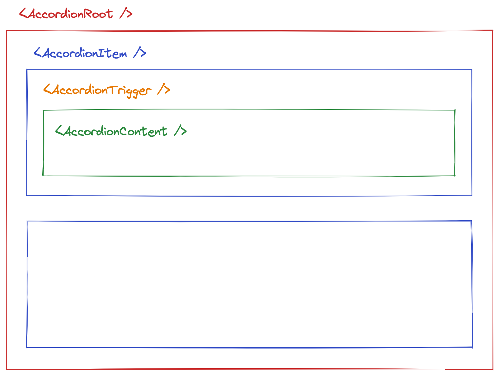

# Accessible Accordion

This repository contains the implementation of an accessible accordion component,
following the [ARIA Authoring Practices Guide (APG)](https://www.w3.org/WAI/ARIA/apg/patterns/accordion/).

The component is implemented using React and it is part of the
[Writing Accessible Component](https://www.meetup.com/react-js-milano/events/289448825) talk.

## Anatomy

